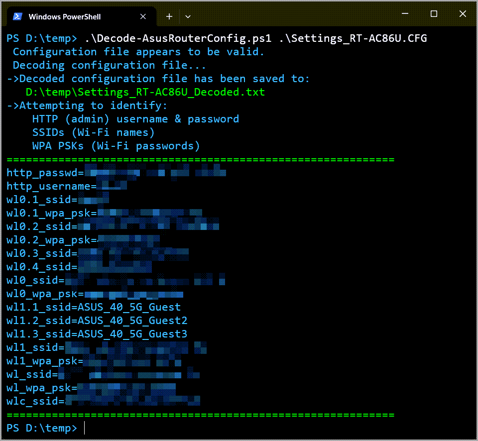

# Asus Router Config Decoder

PowerShell script that decodes the .cfg file resulted from backing up the configuration of an Asus router.\
It saves the entire decoded content of the .cfg file as `[FileName]_Decoded.txt`.\
Admin, PPPOE, and WiFi credentials as `[FileName]_Credentials.txt`.\
If the config file contains a DHCP client list, it will be formatted as pipe-delimited text and saved as `[FileName]_DHCP.txt`.\
It also displays the following information if found in the config file:

- Admin username
- Admin password
- SSIDs (Wi-Fi names)
- WPA PSKs (Wi-Fi passwords)
- PPPOE credentials

Based on the [this Bash script](https://github.com/billchaison/asus-router-decoder)

Works with PowerShell version 5.1 and above.

[Related blog post](https://vladdba.com/2024/05/19/powershell-decode-asus-router-configuration-backup-file/)

## Usage examples

```powershell
PS>.\Decode-AsusRouterConfig.ps1 '.\Settings_RT-XXXXX.CFG'
```

```powershell
PS>.\Decode-AsusRouterConfig.ps1 'C:\Path\To\File\Settings_RT-XXXXX.CFG'
```

```powershell
 PS>.\Decode-AsusRouterConfig.ps1 '.\Settings_RT-AX86U Pro.CFG' -OutputDirectory 'C:\Decoded'
```

## Tested with configuration files from

- Asus RT-BE88U
- Asus RT-AX86U Pro
- Asus RT-AC86U
- Asus AX58U

## Example screenshot


